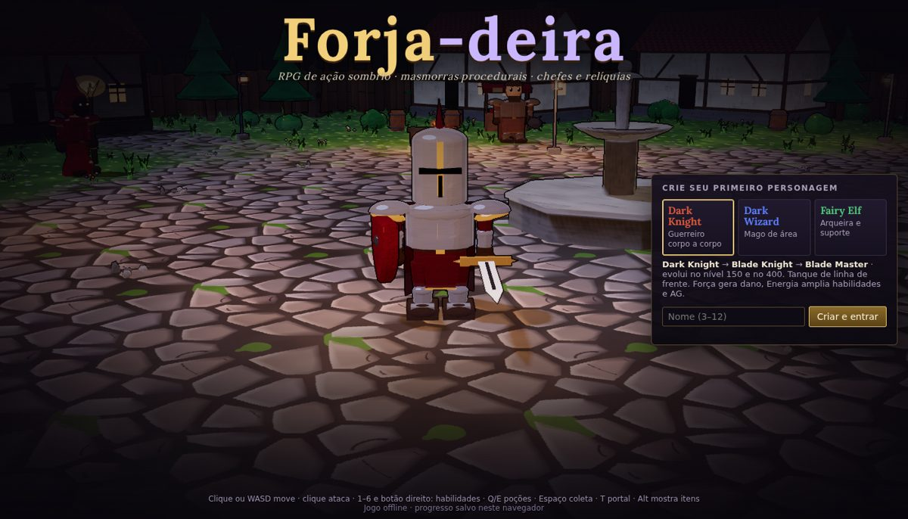
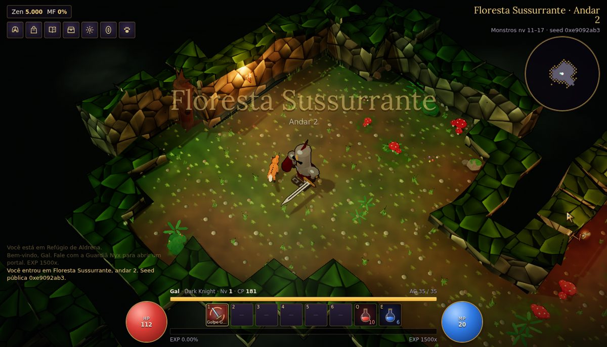
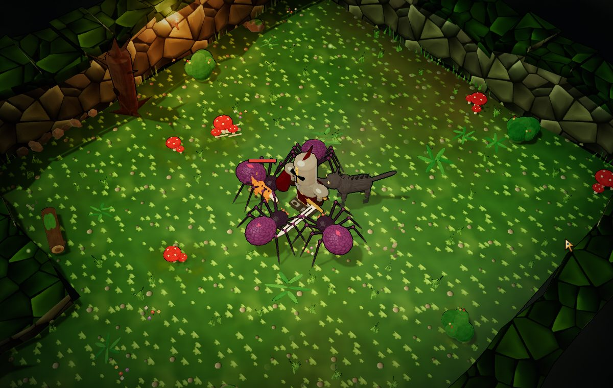
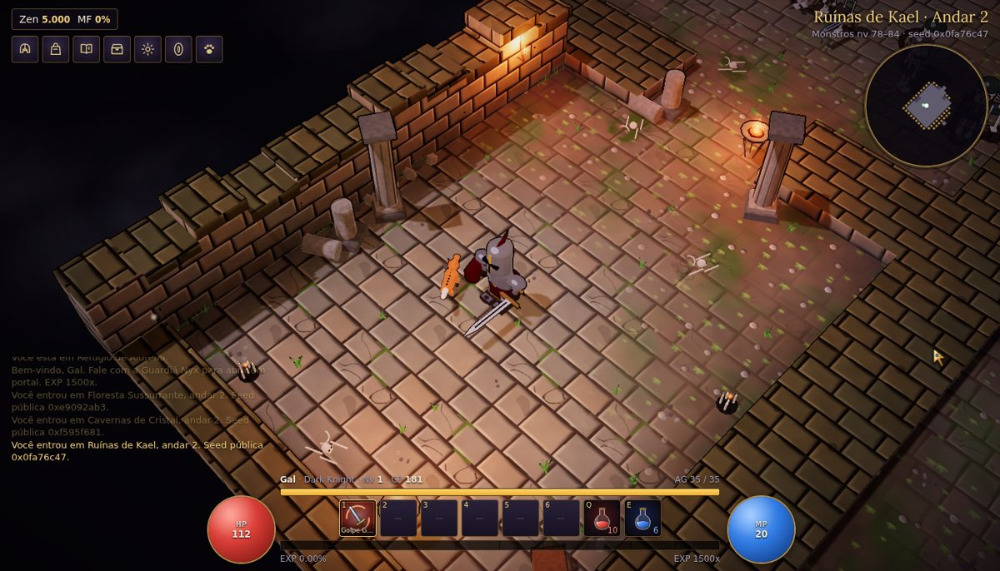
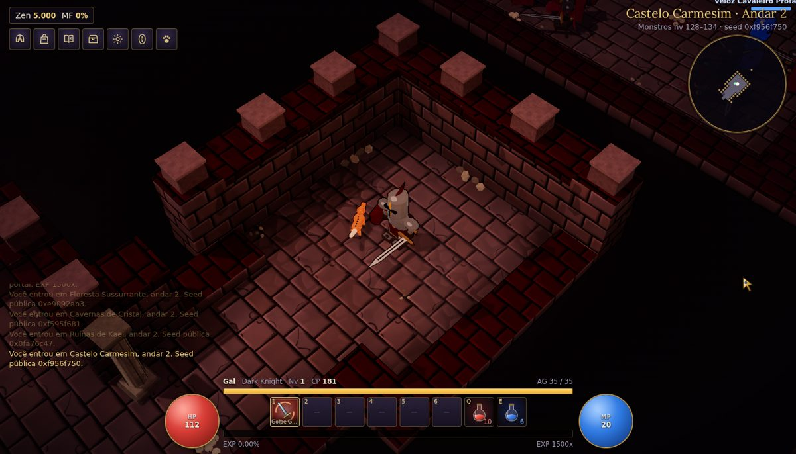

# Forja-deira

RPG de ação isométrico, sombrio e **100% offline**, feito com Three.js (r160) e arte
procedural. Progressão ao estilo MU Online (atributos, evolução de classe, resets,
jewels, itens Excelentes) com masmorras procedurais ao estilo Torchlight.



| | |
|---|---|
|  |  |
|  |  |

## Jogar

**Online:** https://ltravezani.github.io/forja-deira/ (publicado pelo GitHub Pages a cada push na `main`).

**Offline:** baixe e abra `dist/forja-deira.html` no navegador. É um arquivo único: não precisa de internet,
servidor nem instalação. O progresso fica salvo no próprio navegador (`localStorage`).

Controles: clique ou WASD move · clique ataca · 1–6 e botão direito lançam
habilidades · Q/E poções · Espaço coleta · T portal · C/I/K/L/O painéis · Esc pausa ·
Alt mostra todos os itens · botão do meio (ou Ctrl + arrastar) gira a câmera.

## Desenvolver

Requisitos: Python 3 (build). Node 18+ para testes e checagem de sintaxe.
Playwright só para o teste de fumaça.

```bash
python3 tools/build.py        # gera dist/forja-deira.html (único, offline) e dist/dev.html
npm test                      # testes de lógica (node --test)
python3 tests/smoke.py        # ponta a ponta no Chromium headless (dist/forja-deira.html)
python3 tests/smoke.py dist/dev.html
```

Para desenvolver com os módulos ES nativos (sem rebuild a cada mudança), sirva a
pasta do projeto por HTTP e abra `dist/dev.html`:

```bash
python3 -m http.server 8000   # depois: http://localhost:8000/dist/dev.html
```

## Estrutura

```
src/
  shell.html        HTML + CSS da interface (fonte do título embutida)
  rules.js          regras puras: classes, atributos, itens, drops, EXP (usadas também pelos testes)
  main.js           ponto de entrada: valida, carrega o save, registra a entrada, inicia o laço
  debug.js          gancho window.__FORJA_DEBUG para os testes automatizados
  core/             config (valores ajustáveis), estado/save, laço principal, utilitários
  engine/           renderer/câmera, partículas e anéis, overlay de números, áudio sintetizado
  art/              texturas, materiais, geometrias e modelos procedurais
  world/            biomas, geração de masmorras, grade/A*, grade espacial, kit de adereços, montagem do nível
  game/             jogador, monstros, combate, habilidades, projéteis, loot, inventário/CP, aliados, NPCs, zonas, sessão
  input/            mouse/teclado, seleção no mundo
  scenes/           cena de título e cena de jogo (cadências de atualização)
  ui/               HUD, painéis, inventário, diálogos, título, pausa, cursor, ícones, rótulos, minimapa
tests/              testes Node (*.test.mjs) e smoke.py (Playwright)
tools/build.py      empacotador próprio (sem dependências)
vendor/three.js     Three.js r160
docs/               GDD, relatório da refatoração e capturas de tela
.github/workflows/   CI (build + testes) e publicação no GitHub Pages
```

Convenções: módulos ES com `import { a } from './x.js'` e `export` só em declarações
(sem `default`, `as` nem `export let` — o build recusa); valores ajustáveis em
`src/core/config.js`; balanceamento em `src/rules.js`.

## Créditos

Arte, modelos, texturas e sons são gerados em código. Componentes de terceiros
(Three.js — MIT; fonte Lora — OFL 1.1) estão listados em [THIRD_PARTY.md](THIRD_PARTY.md).
